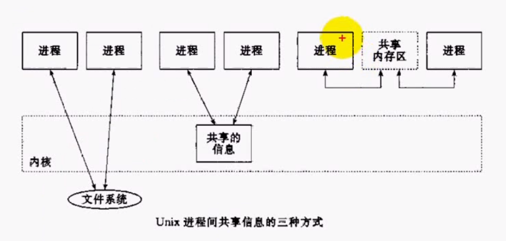

# 进程间通信介绍

## 进程同步与进程互斥
### 顺序程序与并发程序的特征
- 顺序程序特征
  - 顺序性，后一条指令需要在前一条指令执行后才能执行
  - 封闭性，顺序程序在执行过程中执行环境不会受到其他程序干扰，环境主要指的是：程序状态字、通用寄存器、系统堆栈、进程上下文等。
  - 确定性，给定一个输入会有一个对应的输出。
  - 可再现性：不同的时候只要有相同的输入就有相同的输出。
  
- 并发程序特征
  - 共享性
  - 并发性
  - 随机性
  
### 进程互斥
- 由于各进程要求共享资源，而且有些资源需要互斥使用，因此各进程间竞争使用这些资源，进程的这种关系成为**进程的互斥**。
- 系统中某些资源一次只允许一个进程使用，这样的资源称为**临界资源**或**互斥资源**。
- 在进程中涉及到互斥资源的程序段叫**临界区**。

### 进程同步
- 多个进程需要互相配合共同完成一项任务称为**进程同步**。
- 实例：
```
司机P1
while(1){
  启动车辆；
  正常运行；
  到站停车；
}

售票员P2
while(1){
  关门；
  售票；
  开门；
}
```

## 进程间通信的目的
- 数据传输：一个进程需要将自己的数据传递给另外一个进程。
- 资源共享：多个进程之间共享同样的资源。
- 通知事件：一个进程需要向另一个或一组进程发送消息，通知它（他们）发生了某种事件（如进程终止时需要通知父进程）。
- 进程控制：有些进程希望完全控制另一个进程的执行（如Debug），此时控制进程希望能够拦截另一个进程的所有陷入和异常，并能够及时知道它的状态改变。

## 进程间通信的发展
- 管道，最古老的进程间通信方式，只能用于父子进程或兄弟进程之间。
- System V，在管道的基础上做出了一些拓展。
- POSIX，一种标准，规定了一些进程间通信的机制。

## 进程间通信的分类
- 文件
- 文件锁
- （匿名）管道和有名管道
- 信号
- 消息队列
- 共享内存
- 信号量
- 互斥量
- 条件变量
- 读写锁
- 套接字

## 进程间共享信息的三种方式


## IPC对象的持续性
- 随进程持续：一直存在直到打开的最后一个进程结束。（如pipe和FIFO）
- 随内核持续：一直存在直到内核自举或显示删除（如System V消息队列、共享内存、信号量）
- 随文件系统持续：一直存在直到显式删除、即使内核自举还存在。（POSIX消息队列、共享内存、信号量如果是使用映射文件来实现）

## 死锁
### 概念
死锁是指多个进程之间相互等待对方的资源，而在得到对方资源之前又不释放自己的资源，这样，造成循环等待的一个现象。如果所有进程都在等待一个不可能发生的事，则进程就死锁了。
### 产生的必要条件
- 互斥条件：进程对资源进行排他性使用，即在一段时间内某资源仅为一个进程所占用。
- 请求和保持条件：当进程因请求资源而阻塞时，对已获得的资源保持不放。
- 不可剥夺条件：进程已获得的资源在未使用完之前不能被剥夺，只能在使用完之后由进程自己释放。
- 环路等待条件：各个进程组成封闭的环形链，每个进程都等待下一个进程所占用的资源。
### 防止方法
- 资源一次性分配（破坏请求和保持条件）
- 可剥夺资源（破环不可剥夺条件）
- 资源有序分配法（破坏环路等待条件）
### 避免死锁
- 预防死锁的几种策略，会严重地损害系统性能。因此在避免死锁时，要**施加较弱的限制**，从而获得较满意的系统性能。 
- 由于在避免死锁的策略中，允许进程动态地申请资源。因而，系统在进行资源分配之前**预先计算资源分配的安全性**。若此次分配不会导致系统进入不安全状态，则将资源分配给进程；否则，进程等待。其中最具有代表性的避免死锁算法是**银行家算法**。
### 银行家算法
为了保证资金的安全，银行家规定：
1. 当一个顾客对资金的最大需求量不超过银行家现有的资金时就可接纳该顾客；
2. 顾客可以分期贷款，但贷款的总数不能超过最大需求量
3. 当银行家现有的资金不能满足顾客尚需的贷款数额时，对顾客的贷款可推迟支付，但总能使顾客在有限的时间里得到贷款
4. 当顾客得到所需的全部资金后，一定能在有限的时间里归还所有的资金.
### 哲学家就餐问题
- 五个哲学家围在一个圆桌就餐，每个人都必须拿 起两把叉子矛能用餐
- 问题解法
  - 服务生解法，哲学家拿起叉子前询问服务生，经过允许才拿起叉子
  - 最多4个哲学家同时进入吃饭状态
  - 仅当一个哲学家两边叉子都可用时才允许他拿叉子
  - 给所有哲学家编号，奇数号的哲学家必须首先拿左边的叉子，偶数号的哲学家则反之

## 信号量与PV原语
- 信号量和P、V原语由Dijikstra（迪杰斯特拉）提出
- 信号量
  - 互斥：P、V在同一个进程中
  - 同步： P、V在不同进程中 
- 信号量值含义
  - S>0：S表示可用资源的个数
  - S=0：表示无可用资源，无等待进程
  - S<0：|S|表示等待队列中进程个数

```
// 信号量数据结构
struct semaphore
{
  int value; // 保存计数值
  pointer_PCB queue; // 等待队列
}
// PV原语，原子操作
P(S)
{
  s.value -= 1;
  if(s.value < 0){
    该进程状态设置为等于状态；
    将该进程的PCB插入相应的等待队列s.queue末尾；
  }
}
V(s)
{
  s.value += 1;
  if(s.value <= 0){
    唤醒相应等待队列s.queue中等待的一个进程；
    改变其状态为就绪态；
    并将其插入就绪队列；
  }
}
```

## 用PV原语解决司机与售票员问题
- 司机进程
```
S1(0);
while(1){
  P(S1)
  启动车辆
  正常运行
  到站停车
  V(S2)
}
```
- 售票员进程
```
S2(0);
while(1){
  关门
  V(S1)
  售票
  P(S2)
  开门
}
```
## 用PV原语解决民航售票问题
```
票数 = x
S(1)
------------
P(S)
if(x>0)
  x -= 1;
V(S)
```
## 用PV原语解决汽车租赁问题
- 有一汽车租赁公司有两部敞篷车可以出租，假定同时来了四个顾客都要租敞篷车，那么肯定会有两个人租不到。
```
S(2)
------------
P(S)
租车
换车
V(S)
```