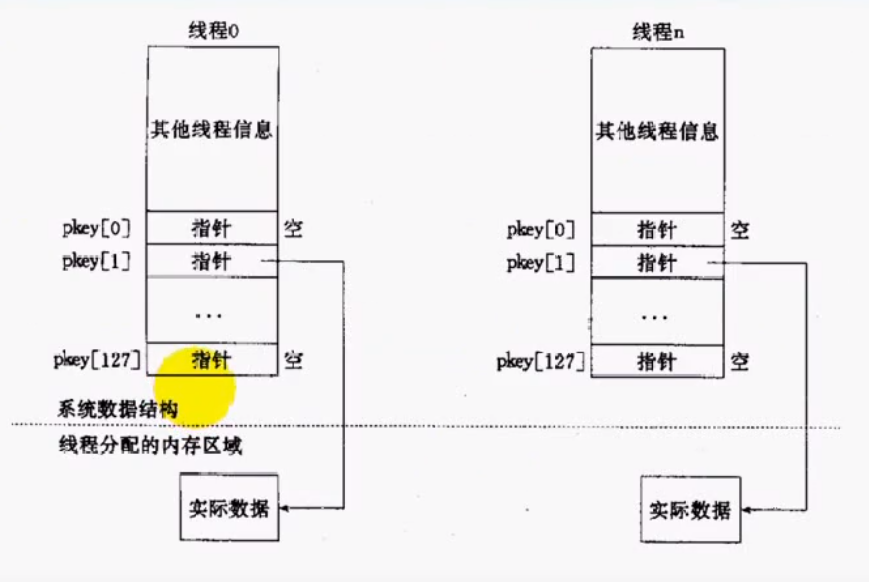

# POSIX线程

[线程介绍](线程介绍.md)

---

## 相关函数

注意点：

1. 与线程有关的函数构成了一个完整的系列，最大多数函数的名称都是以"pthread_"开头
2. 要使用这些函数库，要通过引入头文件<pthread.h>
3. 链接这些线程函数库时需要使用编译器命令的"-lpthread"

### pthread_create
- 功能：创建一个新的线程
- 原型
```
int pthread_create(pthread_t *thread, const pthread_attr_t *attr,
                    void *(*start_routine) (void *), void *arg);
```
- 参数
  - thread：返回线程ID
  - attr：设置线程的属性，NULL表示默认
  - start_routine：是个函数地址，线程启动后要执行的函数
  - arg：传给线程启动函数的参数
- 返回值：成功返回0；失败返回错误码，而非放在errno当中
- 传统的一些函数是，成功返回0，失败返回-1，并且对全 局变量ermno赋值以指示错误。 
- pthreads函数出错时不会设置全局变量errno（而大部分其 他POSIX函数会这样做），而是将错误代码通过返回值返回 。
- pthreads同样也提供了线程内的errno变量，以支持其它使用errno的代码。对于pthreads函数的错误，建议通过返回值判定，因为读取返回值要比读取线程内的errno变量的开销更小。

### pthread_exit
- 功能：线程终止
- 原型
```
void pthread_exit(void *retval);
```
- 参数
  - retval：不要指向一个全局变量
- 返回值：无返回值，和进程一样，线程结束后无法返回到它的调用者

### pthread_self
- 功能：返回线程ID
- 原型
```
pthread_t pthread_self(void);
```
- 返回值：成功返回0，失败返回错误代码

### pthread_cancel
- 功能：取消一个执行中的线程
- 原型
```
int pthread_self(pthread_t thread);
```
- 参数：
  - thread：线程ID
- 返回值：成功返回0，失败返回错误代码

### pthread_detach
- 功能：将一个线程分离，避免产生僵线程
- 原型
```
int pthread_detach(pthread_t thread);
```
- 返回值：成功返回0，失败返回错误代码

对比进程与线程

进程|线程
-|-
pid_t | thread_t
fork | pthread_create
waitpid | pthread_join
exit | pthread_exit
在main函数中return | 在线程入口函数中调用return
僵进程|僵线程
kill | pthread_cancel

---

## 用线程实现回射服务器

[echosrv](02echosrv.c)

---

## 线程属性

初始化与销毁属性
```
int pthread_attr_init(pthread_attr_t *attr);
int pthread_attr_destroy(pthread_attr_t *attr);
```

获取与设置分离属性
```
int pthread_attr_setdetachstate(pthread_attr_t *attr, int detachstate);
int pthread_attr_getdetachstate(const pthread_attr_t *attr, int *detachstate);
```

获取与设置栈大小
```
int pthread_attr_setstacksize(pthread_attr_t *attr, size_t stacksize);
int pthread_attr_getstacksize(const pthread_attr_t *attr, size_t *stacksize);
```

获取与设置栈溢出保护区大小
```
int pthread_attr_setguardsize(pthread_attr_t *attr, size_t guardsize);
int pthread_attr_getguardsize(const pthread_attr_t *attr, size_t *guardsize);
```

获取与设置线程竞争范围
```
int pthread_attr_setscope(pthread_attr_t *attr, int scope);
int pthread_attr_getscope(const pthread_attr_t *attr, int *scope);
```

获取与设置调度策略
```
int pthread_attr_setschedpolicy(pthread_attr_t *attr, int policy);
int pthread_attr_getschedpolicy(const pthread_attr_t *attr, int *policy);
```

获取与设置继承调度策略
```
int pthread_attr_setinheritsched(pthread_attr_t *attr,
                                int inheritsched);
int pthread_attr_getinheritsched(const pthread_attr_t *attr,
                                int *inheritsched);
```

获取与设置调度参数
```
int pthread_attr_setschedparam(pthread_attr_t *attr,
                                const struct sched_param *param);
int pthread_attr_getschedparam(const pthread_attr_t *attr,
                                struct sched_param *param);
```

获取与设置并发级别
```
int pthread_setconcurrency(int new_level);
int pthread_getconcurrency(void);
```
> 仅再N:M线程模型中有效，设置并发级别，给内核一个提示：表示提供给定级别数量的核心线程来映射用户线程是高效的。该方法是非标准的GNU/Linux扩展函数，需要添加宏定义才能获得：#define _GNU_SOURCE

---

## 线程特定数据

- 在单线程程序中，我们经常要用到“全局变量”以实现多个函数间共享 数据。
- 在多线程环境下，由于数据空间是共享的，因此全局变量也为所有线 程所共有。 
- 但有时应用程序设计中有必要提供线程私有的全局变量，仅在某个线 程中有效，但却可以跨多个函数访问。 
- POSIX线程库通过维护一定的数据结构来解决这个问题，这个些数据 称为（Thread-specific Data，或TSD）。

### 相关函数
```
int pthread_key_create(pthread_key_t *key,void(*destructor)(void*));
int pthread_key_delete(pthread_key_t key);

void *pthread_getspecific(pthread_key_t key):
int pthread_setspecific(pthread_key_t key, const void *value);

int pthread_once(pthread_once_t *once_control, void
(*init_routine)(void));
pthread_once_t once_control = PTHREAD__ONCE__INIT;
```