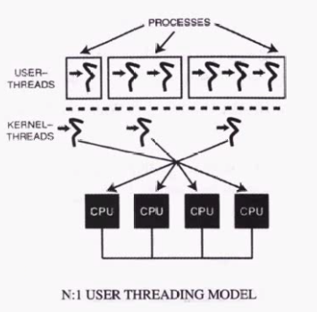
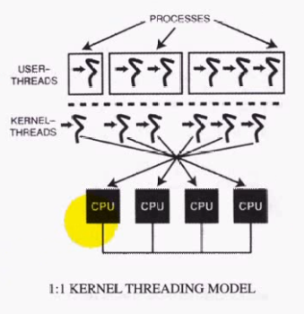
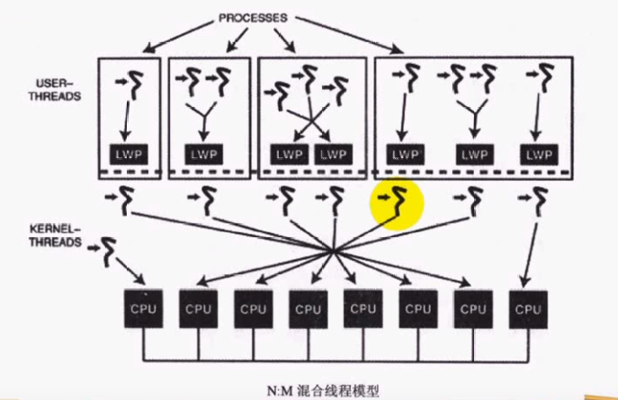
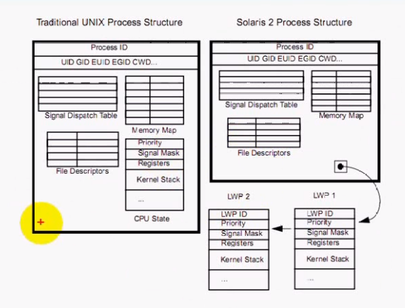

# 线程介绍

## 什么是线程

### 回顾程序与进程
- 程序：完成特定功能的一系列有序指令的集合
  - 由代码段+数据段组成
- 进程：是程序的一次**动态**执行过程
  - 由代码段+数据段+堆栈段+PCB等组成

进程|程序
-|-
动态的|静态的
短暂的|持久的

- 一个进程只能对应一个程序，一个程序可以对应多个进程

### 线程的概念
- 在一个程序里的一个执行路线就叫做线程（thread）。更准确的定义是：线程是“一个进程内部的控制序列”
- 进程至少都有一个执行线程

## 进程与线程
- 进程是资源分配的基本单位
- 线程是程序执行的最小单位
- 线程共享进程数据，但也拥有自己的一部分数据
  - 线程ID
  - 一组寄存器
  - 栈
  - errno
  - 信号状态
  - 优先级

### fork和创建新线程的区别
- 当一个进程执行一个fork调用的时候，会创建出进程的一个新拷贝，新进程将拥有它自己的变量和它自己的PID。这个新进程的运行时间是独立的，它在执行时几乎完全独立于创建它的进程
- 在进程里面创建一个新线程的时候，新的执行线程会拥有自己的堆栈（因此也就有自己的局部变量），但要与它的创建者共享全局变量、文件描述符、信号处理器和当前的 工作目录状态。

## 线程优缺点

### 优点
- 创建一个新线程的代价要比创建一个新进程小得多
- 与进程之间的切换相比，线程之间的切换需要操作系统做的工作要少很多
- 线程占用的资源要比进程少很多
- 能充分利用多处理器的可并行数量
- 在等待慢速I/C操作结束的同时，程序可执行其他的计算任务
- 计算密集型应用，为了能在多处理器系统上运行，将计算分解到多个线程中实现
- I/0密集型应用，为了提高性能，将I/0操作重叠。线程可 以同时等待不同的I/0操作。

### 缺点
- 性能损失。一个很少被外部事件阻塞的计算密集型线程往往无法与共它线程共享同一个处理器。如果计算密集型线程的数量比可用的处理器多，那么可能会有较大的性能损失，这里的性能损失指的是增加了额外的同步和调度开销，而可用的资源不变。
- 健壮性降低。编写多线程需要更全面更深入的考虑，在一个多线程程序里，因时间分配上的细微偏差或者因共享了不该共享的变量而造成不良影响的可能性是很大的，换句话说线程之间是缺乏保护的。
- 缺乏访问控制。进程是访问控制的基本粒度，在一个线程中调用某些OS函数会对整个进程造成影响。
- 编程难度提高。编写与调试一个多线程程序比单线程程序困难得多

## 线程模型

### 线程调度竞争范围
- 操作系统提供了各种模型，用来调度应用程序创建的线程。这些模型之间的主要不同是：在竞争系统资源（特别是CPU时间）时，线程调度竞争范围(thread-scheduling contention scope）不一样
- 进程竞争范围（process contention scope）：各个线程在同一进程竞争“被调度的CPU时问”（但不直接和其他进程中的线程竞争）。
- 系统竞争范围（system contention scope）：线程直接和 “系统范围”内的其他线程竞争。

### N:1用户线程模型

- 早期的“线程实现”建立在“进程控制”机制之上，由用户空间的程序库来管理。OS内核完全不知道线程信息。这些线程被称为用户空间线程。
- 这些线程都工作在“进程竞争范围”
- 在N:1线程模型中，内核不干涉线程的任何生命活动，也不干涉同一进程中的线程环境切换。 
- 在N:1线程模型中，一个进程中的多个线程只能调度到一个CPU，这种约束限制了可用的并行总量。
- 第二个缺点是如果某个线程执行了一个“阻塞式”操作（如 read），那么，进程中的所有线程都会阻塞，直至那个操作结束。为此，一些线程的实现是为这些阻塞式函数提供包装器，用非阻塞版本替换这些系统调用，以消除这种限制。

### 1:1核心线程模型

- 在1:1核心线程模型中，应用程序创建的每一个线程都由一个核心线程直接 管理。 
- OS内核将每一个核心线程都调到系统CPU上，因此，所有线程都工作在“ 系统竞争范围”。 
- 这种线程的创建与调度由 内核完成，因为这种线程的系统开销比较大（但一般来说，比进程开销小)

### N:M混合线程模型

- N:M混合线程模型提供了两级控制，将一个或多个用户线程映射为系统的可调度体以实现并行，这个可调度体称为轻量级进程（LWP:Light weight process），LWP再映射到核心线程。