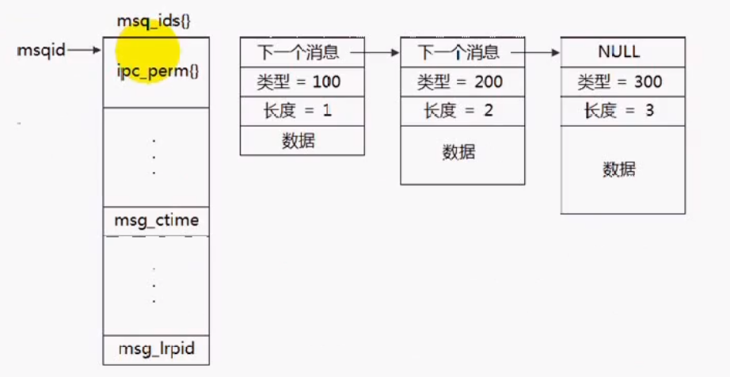
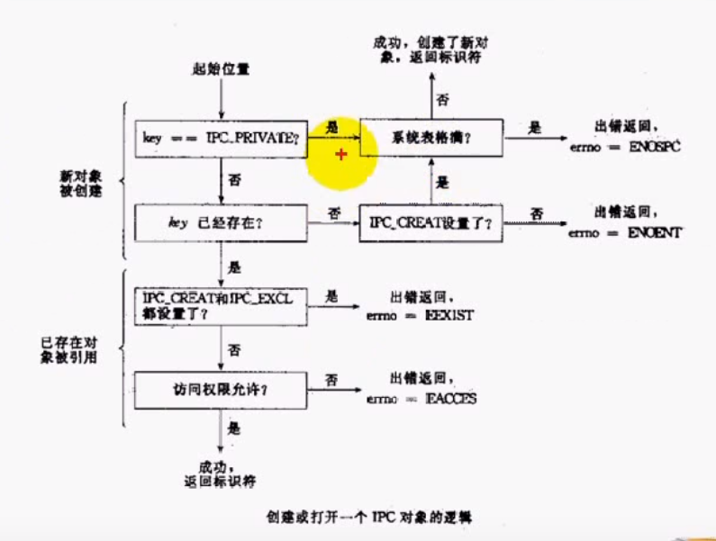

# System V消息队列（一）

## 消息队列
- 消息队列提供了一个从一个进程向另外一个进程发送一块数据的方法
- 每个数据块都被认为是有一个类型，接收者进程接收的数据块可以有不同的类型值
- 消息队列也有管道一样的不足，就是每个消息的最大长度是有上限的（MSGMAX），每个消息队列的总的字节数是有上限的（MSGMNB），系统上消息队列的总数也有一个上限（MSGMNI），可通过cat /proc/sys/kernel/[msgmax or msgmnb or msgmni]查询

## IPC对象数据结构
- 内核为每个IPC对象维护一个数据结构
```
// man 2 msgctl
struct ipc_perm {
    key_t          __key;       /* Key supplied to msgget(2) */
    uid_t          uid;         /* Effective UID of owner */
    gid_t          gid;         /* Effective GID of owner */
    uid_t          cuid;        /* Effective UID of creator */
    gid_t          cgid;        /* Effective GID of creator */
    unsigned short mode;        /* Permissions */
    unsigned short __seq;       /* Sequence number */
};
```

## 消息队列结构
```
// man 2 msgctl
struct msqid_ds {
    struct ipc_perm msg_perm;     /* Ownership and permissions */
    time_t          msg_stime;    /* Time of last msgsnd(2) */
    time_t          msg_rtime;    /* Time of last msgrcv(2) */
    time_t          msg_ctime;    /* Time of last change */
    unsigned long   __msg_cbytes; /* Current number of bytes in
                                    queue (nonstandard) */
    msgqnum_t       msg_qnum;     /* Current number of messages
                                    in queue */
    msglen_t        msg_qbytes;   /* Maximum number of bytes
                                    allowed in queue */
    pid_t           msg_lspid;    /* PID of last msgsnd(2) */
    pid_t           msg_lrpid;    /* PID of last msgrcv(2) */
};
```

## 消息队列在内核中的表示


## 消息队列函数
```
#include <sys/types.h>
#include <sys/ipc.h>
#include <sys/msg.h>

// 功能：用来创建和访问一个消息队列
// @param key:某个消息队列的名字
// @param msgflg:由九个权限标志构成，它们的用法和创建文件时使用的mode模式标志是一样的。
// 返回值：成功返回一个非负整数，失败返回-1
int msgget(key_t key, int msgflg);
int msgctl(int msqid, int cmd, struct msqid_ds *buf);
int msgsnd(int msqid, const void *msgp, size_t msgsz, int msgflg);
ssize_t msgrcv(int msqid, void *msgp, size_t msgsz, long msgtyp,
               int msgflg);
```

