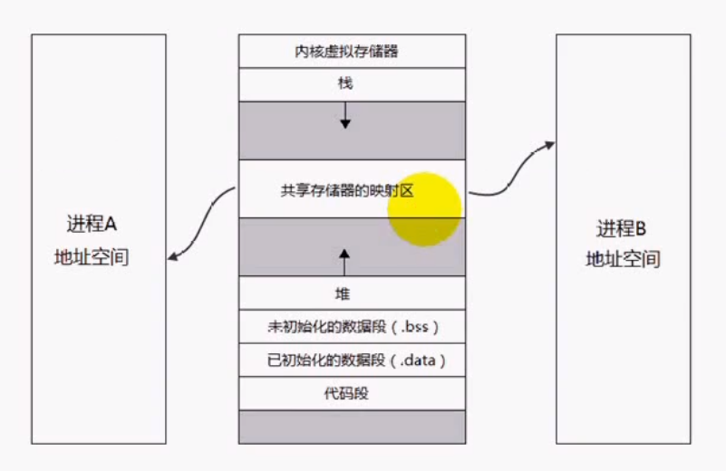
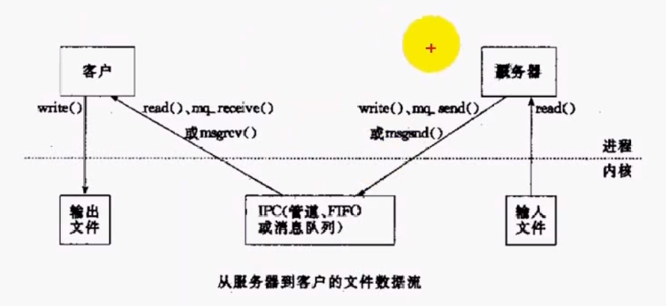
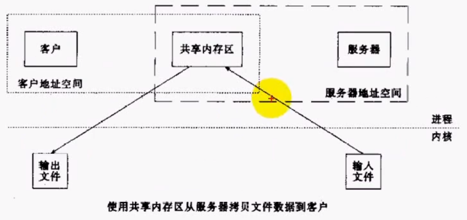
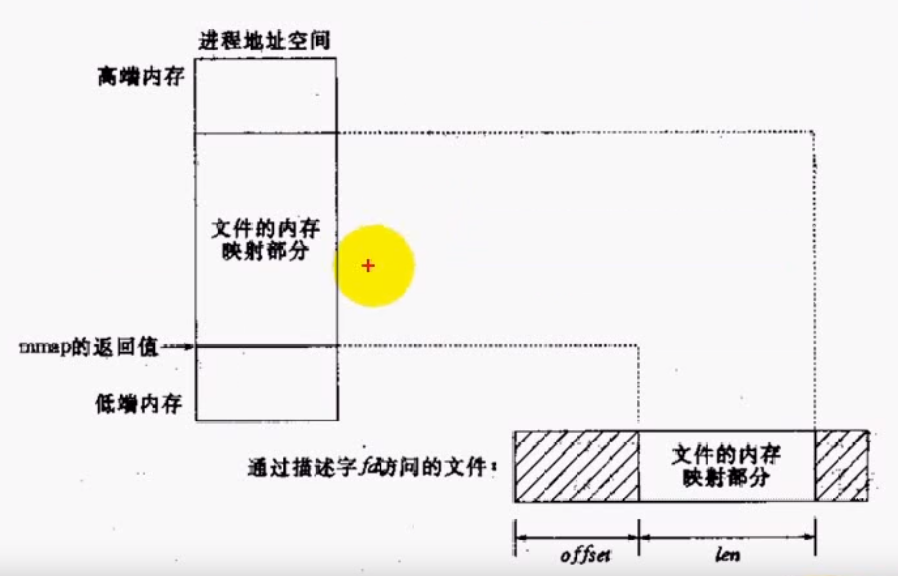

# 共享内存介绍与使用

## 共享内存
- 共享内存是最快的IPC形式。一旦这样的内存映射到共享它的进程的地址空间，这样进程间数据传递不再设计到内核态与用户态的切换，换句话说进程不再通过执行进入内核的系统调用来传递彼此的数据。

## 共享内存示意图


## 共享内存与管道、消息队列传递数据的对比

- 管道与消息队列，每次发送、接收信息需要两次进入系统调用。

- 共享内存，每次发送、接收信息仅需要一次进入系统调用，效率大大提高。

## mmap函数
- 功能：将文件或者设备空间映射到共享内存区。
- 原型：
```
#include <sys/mman.h>
void *mmap(void *addr, size_t length, int prot, int flags,
            int fd, off_t offset);
```
- 参数
  - addr:要映射的起始地址，通常指定为NULL，让内核自动选择
  - len:映射到进程地址空间的字节数
  - prot:映射区保护方式
  - flags:标志
  - fd:文件描述符，可设置为-1，映射匿名内存空间，用于亲缘进程间通信
  - offset:从文件头开始的偏移量
- 返回值：成功返回映射到的内存区的起始地址，失败返回-1

prot|说明
-|-
PROT_EXEC | Pages may be executed.
PROT_READ | Pages may be read.
PROT_WRITE | Pages may be written.
PROT_NONE | Pages may not be accessed.

flag|说明
-|-
MAP_SHARED|变动是共享的
MAP_PRIVATE|变得是私有的
MAP_FIXED|准确解释addr参数
MAP_ANONYMOUS|建立匿名映射区不涉及文件

- 内存映射文件示意图


## munmap函数
- 功能：取消mmap函数建立的映射
- 原型
```
int munmap(void *addr, size_t length);
```
- 参数
  - addr：映射的内存起始地址
  - len：映射到进程空间的字节数
- 返回值：成功返回0，失败返回-1

## msync函数
- 功能：对映射的共享内存执行同步操作
- 原型
```
int msync(void *addr, size_t length, int flags);
```
- 参数
  - addr：内存起始地址
  - len：长度
  - flags：选项
- 返回值：成功返回0，失败返回-1

flags|说明
-|-
MS_ASYNC|执行异步写
MS_SYNC|执行同步写
MS_INVALIDATE|使高速缓存中的而数据失效

## 注意点
- 映射不能改变文件的大小
- 可用于进程间通信的有效地址空间不完全受限于被映射文件的大小，因为映射是基于内存页面的
- 文件一旦被映射后，所有对映射区域的访问实际上是对内存区域的访问。映射区域内容写回文件时，所写内容不能超过文件的大小。